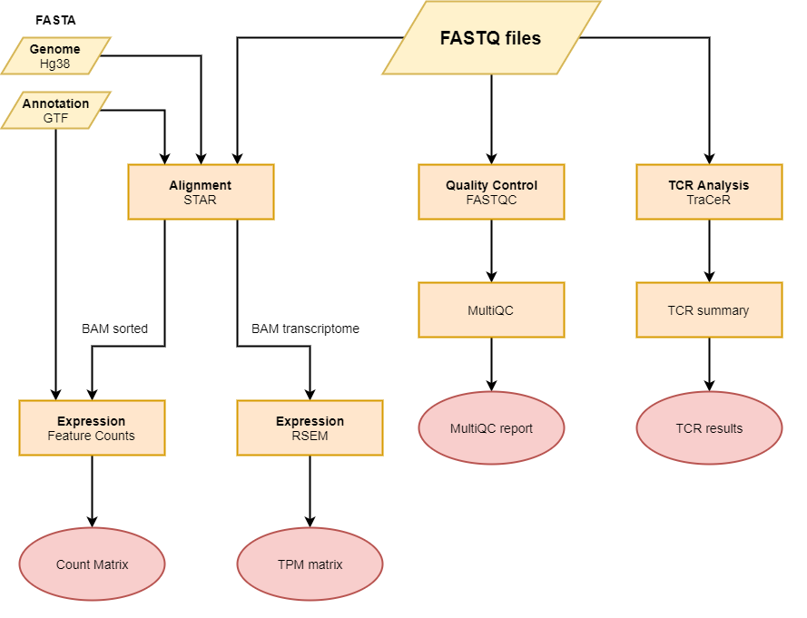

# nf-core/smartseq

**Preprocess scRNA-seq data generated with the SmartSeq2 protocol.**.

## Introduction
The pipeline is built using [Nextflow](https://www.nextflow.io), a workflow tool to run tasks across multiple compute infrastructures in a very portable manner. It comes with docker containers making installation trivial and results highly reproducible.

## Documentation
The nf-core/smartseq pipeline comes with documentation about the pipeline, found in the `docs/` directory:

1. [Installation](https://nf-co.re/usage/installation)
2. Pipeline configuration
    * [Local installation](https://nf-co.re/usage/local_installation)
    * [Adding your own system config](https://nf-co.re/usage/adding_own_config)
    * [Reference genomes](https://nf-co.re/usage/reference_genomes)
3. [Running the pipeline](docs/usage.md)
4. [Output and how to interpret the results](docs/output.md)
5. [Troubleshooting](https://nf-co.re/usage/troubleshooting)

This pipeline was developed to process single cell RNA-seq data generated 
using the Smart-Seq2 protocol.

The pipeline features: 
* Quality control using `fastqc` and `multiqc`
* Alignment using `STAR`
* Quantification using `rsem` or `featureCounts`
* TCR analysis using `TraCeR`.

## Credits
nf-core/smartseq was originally written by [Sandro Carollo](https://github.com/sandrocarollo),
[Giorgos Fotakis](https://github.com/abyssum) and [Gregor Sturm](https://github.com/grst)
